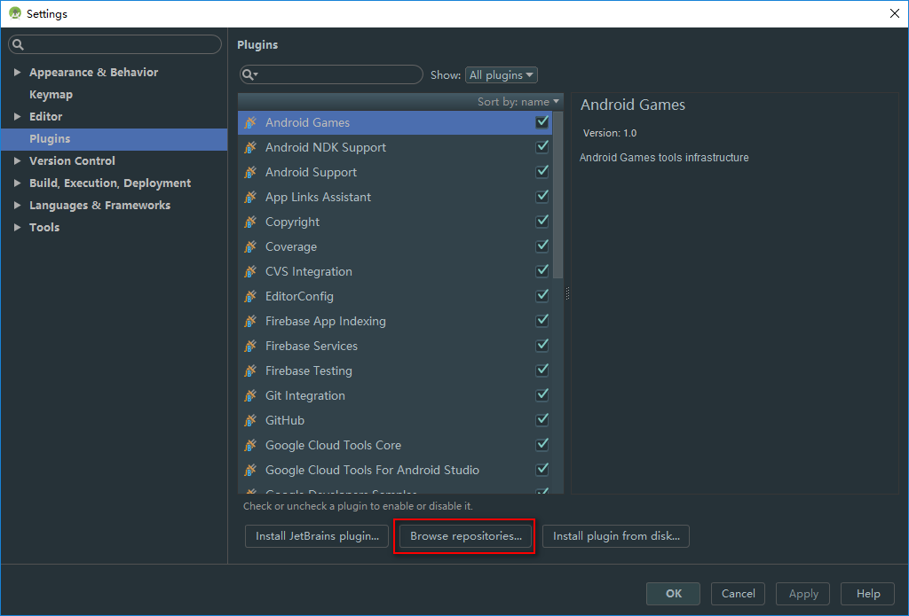

## 安装Android Studio后进不去
参考：[checking for updated SDK components （AndroidStudio第一次启动一直进不去）](http://blog.csdn.net/u013647382/article/details/46529649)

安装Android Studio后进不去，一直卡在这个界面：


或者卡在这个界面：


原因就是：Android Studio检查到有更新的SDK，在下载。但是大家都知道google被墙，除非翻墙，肯定下不下来的。所以解决方案就是让Android Studio第一次启动时跳过第一次设置选项。

解决步骤：
> - 找到Android Studio安装目录下bin目录中找到idea.properties文件（具体路径大家的不一样，我的是：C:\Program Files\Android\Android Studio\bin）
>
>- 用记事本打开idea.properties，在最后一行添加一句：disable.android.first.run=true
>
>- 重新启动AS，就会神奇发现AS可跳过第一次启动设置选项，直接进入。

就这样就完成了，看到我们添加的一句disable.android.first.run=true，学过英语的人就知道意思是：android第一次运行配置取消。


<br>
<br>


## Android Studio 打造一个炫酷的个性化主题
参考：[该为你的Android Studio 打造一个炫酷的个性化主题了](http://www.jianshu.com/p/e02ee207d9c4)

#### 安装主题插件：``Material Theme UI``
> Material Theme UI 是一个Android Studio 插件，它提供了三种主题供选择，它连除了代码区域之外的风格也改变了。

进到Android Studio的设置里面：


进入``Plugins`` -> ``Browse repositories...`` :


在搜索框输入``Material Theme UI``，然后点击右边的安装，最后重启Android Studio即可：


<br>


#### 修改Logcat样式

进到Android Studio的设置里面：


然后进入``Editor`` -> ``Colors&Fonts`` -> ``Android Logcat``：


各项颜色值设置如下：
- Assert: #AA66CC
- Debug: #33B5E5
- Error: #FF4444
- Info: #99CC00
- Verbose: #FFFFFF
- Warning: #FFBB33

注意：需要将``Use inherited attributes``的复选框不选中。

显示效果如下：


<br>
<br>

## Android Studio全局搜索
进到Android Studio的设置里面：


进入Keymap:


在右边的搜索框输入``Find``，找到``Find...``右键选择``Remove Ctrl+F``。
然后找到``Find in Path...``右键选择``Remove Ctrl+Shift+F``，然后右键选择``Add Keyboard Shortcut``，最后添加组合快捷键``Ctrl+F``即可：


<br>
<br>

## 生成的签名APK指定文件名

在 Module 的 build.gradle 文件中添加一个获取当前时间的函数（在``Android``节点下）：
```
android {
	//......
	def getCurTime() {
			return new Date().format("yyyyMMddHHmm", TimeZone.getTimeZone("Asia/Shanghai"))
	}
	//......
}
```

在 Module 的 build.gradle 文件再添加以下语句(也是在``Android``节点下)，编译生成文件名如：MyApp_201801040921_v1.0.apk
```
android.applicationVariants.all { variant ->
    variant.outputs.each { output ->
        output.outputFile = new File(output.outputFile.parent, "MyApp_"+ getCurTime() + "_v" + android.defaultConfig.versionName + ".apk" );
    }
}
```

Android Studio 3.0及以上需要注意修改：
- all() 代替 each()
- outputFileName 代替 output.outputFile

```
android.applicationVariants.all { variant ->
    variant.outputs.all { output ->
        def filename = "MyApp_" + getCurTime()
        filename = filename + "_v" + android.defaultConfig.versionName
        filename = filename + "_" + buildType.name + ".apk"
        outputFileName  = filename
    }
}
```

<br>
<br>
<br>
<br>

