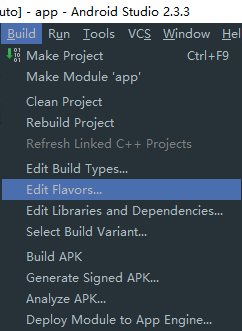
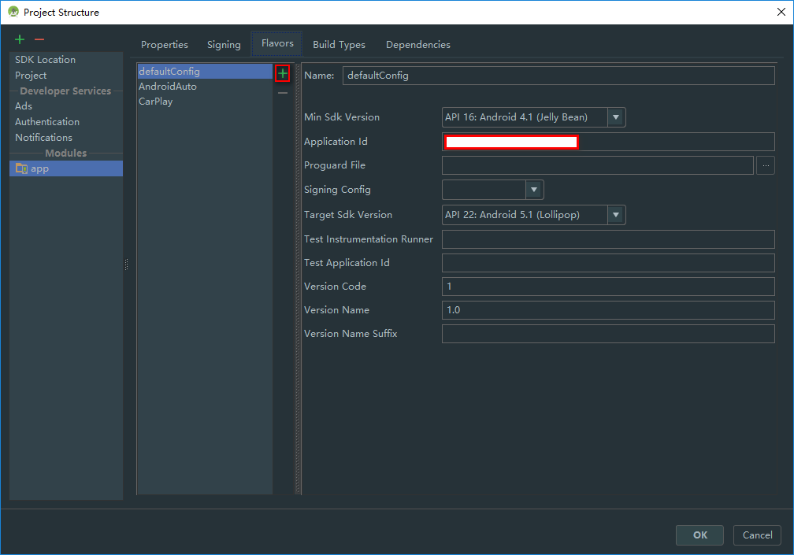

# 参考
[在同一台android设备上安装多个同一项目的apk](http://www.jianshu.com/p/9a0823a8f7c3)

[多渠道打包之动态修改App名称，图标，applicationId，版本号，添加资源](http://blog.csdn.net/abc6368765/article/details/52786509)

[【Android】使用Gradle实现分渠道打包，指定应用名称，应用图标，应用标识和环境切换](http://blog.csdn.net/u011511368/article/details/51919811)

# 操作步骤
编辑Flavors
   


刚进入Flavors会看到有个默认的“defaultConfig”，再添加两个flavor，除了Application Id其它的保持和默认的一样。
Application Id简单设置在原始包名中添加一个后缀就行
接下来打开app/build.gradle文件会看到多了一部分代码
```
android {

	......
	......

    productFlavors {
        AndroidAuto {
            minSdkVersion 16
            applicationId '原始包名.AndroidAuto'
            targetSdkVersion 22
            versionCode 1
            versionName '1.0'
        }
        CarPlay {
            minSdkVersion 16
            applicationId '原始包名.CarPlay'
            targetSdkVersion 22
            versionCode 1
            versionName '1.0'
        }
    }
}
```


<br>
<br>
<br>
<br>
<br>