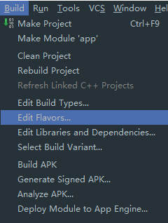
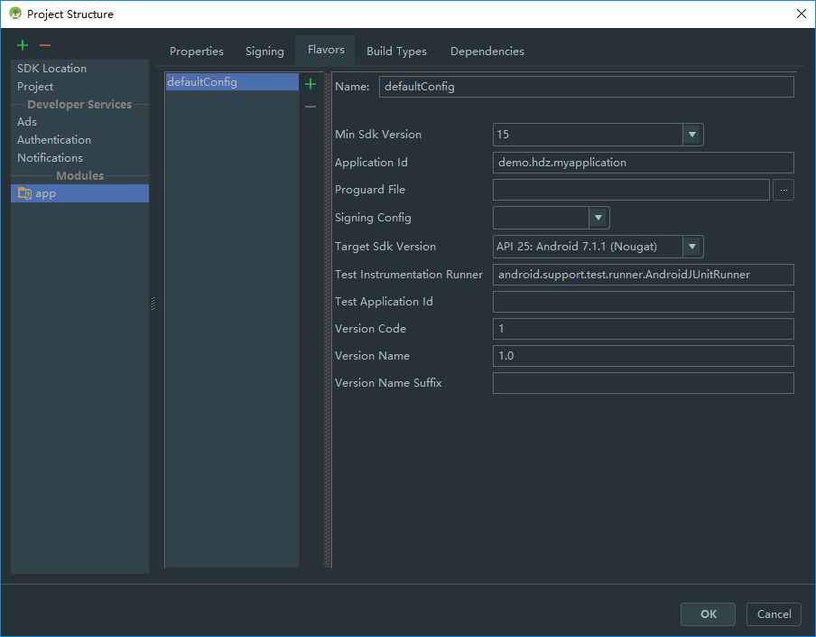
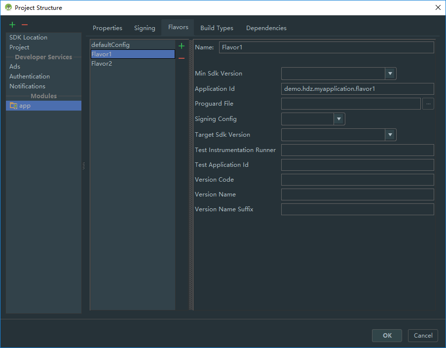
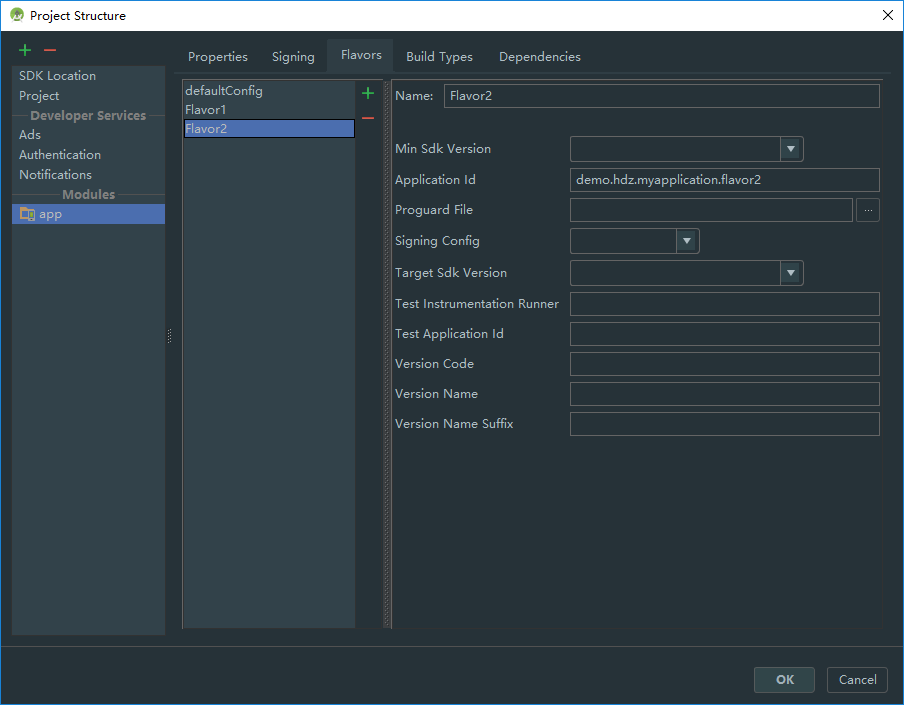
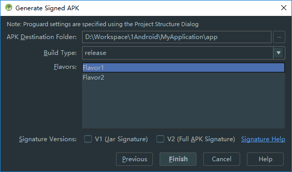

# 参考
[在同一台android设备上安装多个同一项目的apk](http://www.jianshu.com/p/9a0823a8f7c3)

[多渠道打包之动态修改App名称，图标，applicationId，版本号，添加资源](http://blog.csdn.net/abc6368765/article/details/52786509)

[【Android】使用Gradle实现分渠道打包，指定应用名称，应用图标，应用标识和环境切换](http://blog.csdn.net/u011511368/article/details/51919811)

# 操作步骤
菜单栏 -> Build -> Edit Flavors...
   

刚进入Flavors会看到有个默认的“defaultConfig”，这是默认的Flavor，继承Module下的build.gradle中的``android``节点下的``defaultConfig``。



再添加两个flavor，修改Application Id即可，其它部分会默认继承``defaultConfig``。Application Id简单设置在原始包名中添加一个后缀就行。
  

接下来打开``app/build.gradle``文件会看到``android``节点下多了一部分代码：
```
android {

	......
	......

    productFlavors {
        Flavor2 {
            applicationId 'demo.hdz.myapplication.flavor2'
        }
        Flavor1 {
            applicationId 'demo.hdz.myapplication.flavor1'
        }
    }
}
```

<br>

## 指定生成Apk文件名
在``app/build.gradle``文件末尾添加以下代码即可生成以flavor命名的Apk文件名，如Flavor1.apk、Flavor2.apk
```
android.applicationVariants.all { variant ->
    variant.outputs.each { output ->
        if (variant.productFlavors[0] != null) {
            output.outputFile = new File(output.outputFile.parent, "${variant.productFlavors[0].name}.apk");
        } else {
			//当没有多渠道打包，则指定文件名为MyApp.apk
            output.outputFile = new File(output.outputFile.parent, "MyApp.apk");
        }
    }
}
```

<br>

## 指定应用名称及logo
要修改app名称，app图标(注意桌面app图标和应用中的app图标)，我们可以使用Gradle的manifestPlaceholders实现。首先我们需要在配置文件(AndroidManifest.xml)预先定义好占位符，大致如下：
```
   <application
        android:allowBackup="true"
        android:hardwareAccelerated="true"
        android:icon="${APP_LOGO_PATH}"
        android:label="${APP_NAME}"
        android:supportsRtl="true"
        android:theme="@style/AppTheme">
        <activity
            android:name=".MainActivity"
            android:configChanges="orientation|keyboardHidden|screenSize"
            android:label="${APP_NAME}"
            android:icon="${DESKTOP_LOGO_PATH}"
            android:launchMode="singleTask"
            android:screenOrientation="landscape"
            android:theme="@style/FullscreenTheme">
```

然后在``app/build.gradle``文件中的``productFlavors``中添加：

```
productFlavors {
        Flavor2 {
            applicationId 'demo.hdz.myapplication.flavor2'
			manifestPlaceholders = [DESKTOP_LOGO_PATH: "@drawable/logo_desktop_flavor2", APP_LOGO_PATH: "@drawable/logo_flavor2", APP_NAME: "Flavor2"]
        }
        Flavor1 {
            applicationId 'demo.hdz.myapplication.flavor1'
			manifestPlaceholders = [DESKTOP_LOGO_PATH: "@drawable/logo_desktop_flavor1", APP_LOGO_PATH: "@drawable/logo_flavor1", APP_NAME: "Flavor1"]
        }
    }
```

记得要默认中也要添加一样的设置，在``defaultConfig`中修改。
```
android {
    compileSdkVersion 25
    buildToolsVersion "25.0.3"

	def APP_LOGO     = "@drawable/logo"
    def DESKTOP_LOGO = "@drawable/logo"
    def APP_NAME     = "MyApp"

    defaultConfig {
        applicationId "demo.hdz.myapplication"
        minSdkVersion 15
        targetSdkVersion 25
        versionCode 1
        versionName "1.0"
        testInstrumentationRunner "android.support.test.runner.AndroidJUnitRunner"

		manifestPlaceholders = [DESKTOP_LOGO_PATH:"${DESKTOP_LOGO}", APP_LOGO_PATH: "${APP_LOGO}", APP_NAME: "${APP_NAME}"]

    }
}
```

<br>

## 生成签名Apk
在生成签名Apk的最后一步选择自己需要的Flavor即可：


<br>
<br>
<br>
<br>
<br>