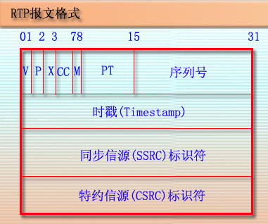
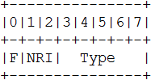

# RTP协议

## 概述
RTP全称：Real-time Transport Protocol，实时传输协议，其主要用于在互联网上传递音频和视频的标准数据包。通常与UDP协议一起使用。

## RTP报文格式
RTP报文由两部分组成：报头和有效载荷。

在发送端，上层应用程序以分组形式将编码后的媒体数据传给RTP通信模块，作为RTP报文的有效载荷，RTP通信模块将根据上层应用提供的参数在有效载荷前添加RTP报头，形成RTP报文，通过Socket接口选择UDP协议发送出去。

在接收端，RTP通信模块通过通过Socket接口接收到RTP报文后，将RTP报头分离出来作相应处理，再将RTP报文的有效载荷作为数据分组传递给上层应用。

RTP报头格式如下图所示：

- V：RTP协议的版本号，占2位，当前协议版本号为2。

- P：填充标志，占1位，如果P=1，则在该报文的尾部填充一个或多个额外的八位组，它们不是有效载荷的一部分。

- X：扩展标志，占1位，如果X=1，则在RTP报头后跟有一个扩展报头。

- CC：CSRC计数器，占4位，指示CSRC标识符的个数。

- M：标记，占1位，不同的有效载荷有不同的含义，对于视频，标记一帧的结束；对于音频，标记会话的开始。

- PT: 有效荷载类型，占7位，用于说明RTP报文中有效载荷的类型，如GSM音频、JPEM图像等,在流媒体中大部分是用来区分音频流和视频流的，这样便于客户端进行解析。

- 序列号：占16位，用于标识发送者所发送的RTP报文的序列号，每发送一个报文，序列号增1。这个字段当下层的承载协议用UDP的时候，网络状况不好的时候可以用来检查丢包。同时出现网络抖动的情况可以用来对数据进行重新排序，序列号的初始值是随机的，同时音频包和视频包的sequence是分别记数的。

- 时戳(Timestamp)：占32位，必须使用 90kHz 时钟频率。时戳反映了该RTP报文的第一个八位组的采样时刻。接收者使用时戳来计算延迟和延迟抖动，并进行同步控制。

- 同步信源(SSRC)标识符：占32位，用于标识同步信源。该标识符是随机选择的，参加同一视频会议的两个同步信源不能有相同的SSRC。

- 特约信源(CSRC)标识符：每个CSRC标识符占32位，可以有0～15个。每个CSRC标识了包含在该RTP报文有效载荷中的所有特约信源。贡献源列表（CSRC List）：0～15项，每项32比特，用来标志对一个RTP混合器产生的新包有贡献的所有RTP包的源。由混合器将这些有贡献的SSRC标识符插入表中。SSRC标识符都被列出来，以便接收端能正确指出交谈双方的身份。

## RTP荷载H264码流
荷载格式定义三个不同的基本荷载结构，接收者可以通过RTP荷载的第一个字节后5位（如图下图）识别荷载结构。

1)   单个NAL单元包：荷载中只包含一个NAL单元。NAL头类型域等于原始 NAL单元类型,即在范围1到23之间。

2)   聚合包：本类型用于聚合多个NAL单元到单个RTP荷载中。本包有四种版本,单时间聚合包类型A (STAP-A)，单时间聚合包类型B (STAP-B)，多时间聚合包类型(MTAP)16位位移(MTAP16), 多时间聚合包类型(MTAP)24位位移(MTAP24)。赋予STAP-A, STAP-B, MTAP16, MTAP24的NAL单元类型号分别是 24,25, 26, 27。

3)   分片单元：用于分片单个NAL单元到多个RTP包。现存两个版本FU-A，FU-B,用NAL单元类型 28，29标识。

常用的打包时的分包规则是：如果小于MTU采用单个NAL单元包，如果大于MTU就采用FUs分片方式。

参考：
[RTP协议全解析（H264码流和PS流）](http://blog.csdn.net/chen495810242/article/details/39207305)

[RTP协议](http://www.360doc.com/content/11/1009/15/496343_154624612.shtml)

[RTP协议解读](http://blog.csdn.net/niu_gao/article/details/6946781)

[RTP协议分析](http://blog.csdn.net/bripengandre/article/details/2238818)

[RTP协议](https://www.cnblogs.com/qingquan/archive/2011/07/28/2120440.html)

[RTP协议介绍](https://wenku.baidu.com/view/376d9c95da38376baf1fae63.html)

#RTSP协议

## 概述
RTSP(Real-TimeStream Protocol )是一种基于文本的应用层协议，在语法及一些消息参数等方面，RTSP协议与HTTP协议类似。

RTSP被用于建立的控制媒体流的传输，它为多媒体服务扮演“网络远程控制”的角色。尽管有时可以把RTSP控制信息和媒体数据流交织在一起传送，但一般情况RTSP本身并不用于转送媒体流数据。媒体数据的传送可通过RTP/RTCP等协议来完成。

## 简单的rtsp消息交互
> 一次基本的RTSP操作过程是:首先，客户端连接到流服务器并发送一个RTSP描述命令（DESCRIBE）。流服务器通过一个SDP描述来进行反馈，反馈信息包括流数量、媒体类型等信息。客户端再分析该SDP描述，并为会话中的每一个流发送一个RTSP建立命令(SETUP)，RTSP建立命令告诉服务器客户端用于接收媒体数据的端口。流媒体连接建立完成后，客户端发送一个播放命令(PLAY)，服务器就开始在UDP上传送媒体流（RTP包）到客户端。 在播放过程中客户端还可以向服务器发送命令来控制快进、快退和暂停等。最后，客户端可发送一个终止命令(TERADOWN)来结束流媒体会话。

1. 第一步：查询服务器端可用方法
1.C->S:OPTION request	    //询问S有哪些方法可用
1.S->C:OPTION response      //S回应信息的public头字段中包括提供的所有可用方法过程。

2. 第二步：得到媒体描述信息
2.C->S:DESCRIBE request     //要求得到S提供的媒体描述信息
2.S->C:DESCRIBE response    //S回应媒体描述信息，一般是sdp信息

3. 第三步：建立RTSP会话
3.C->S:SETUP request        //通过Transport头字段列出可接受的传输选项，请求S建立会话
3.S->C:SETUP response       //S建立会话，通过Transport头字段返回选择的具体转输选项，并返回建立的Session ID;

4. 第四步：请求开始传送数据
4.C->S:PLAY request        //C请求S开始发送数据
4.S->C:PLAY response       //S回应该请求的信息

5. 第五步： 数据传送播放中
S->C:发送流媒体数据         // 通过RTP协议传送数据

6. 第六步：关闭会话，退出
6.C->S:TEARDOWN request   //C请求关闭会话
6.S->C:TEARDOWN response  //S回应该请求

参考：
[RTSP协议解析](http://blog.csdn.net/rongdeguoqian/article/details/17888407)

[RTSP协议学习笔记](http://blog.csdn.net/leixiaohua1020/article/details/11955341)